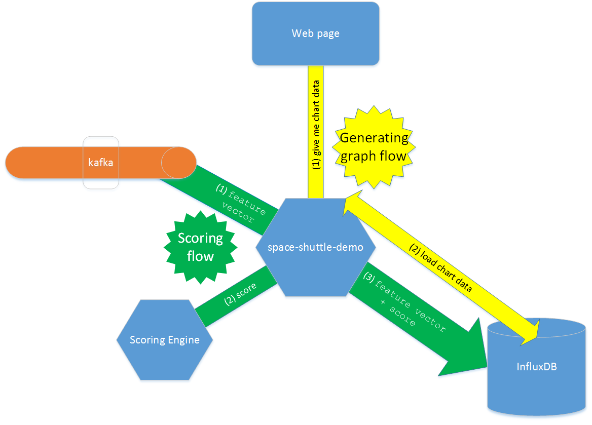

# space-shuttle-demo
Sample application for ATK space shuttle demo

## Overview


#### Scoring flow:
1. Application space-shuttle-demo listens to kafka topic and waits for feature vectors.
2. When a kafka message appears, application asks Scoring Engine to classify received feature vector.
3. Application stores scoring result in InfluxDB.

#### Generating graph flow:
1. Web application asks backend application (space-shuttle-demo) for a anomalies chart.
2. Space-shuttle-demo gets anomalies (classes different than 1) count per minute from InfluxDB.


## Deploying application to TAP
1. Create required services (of does not exist already):
    1. Instance of InfluxDB called `space-shuttle-db`
    1. Instance of Zookeeper called `zookeeper`
    1. Instance of Gateway called `space-shuttle-gateway`
    1. Instance of Scoring Engine called `space-shuttle-scoring-engine` (details in [Scoring Engine](#scoring-engine) section below)
1. Create Java package:
  ```
  mvn package
  ```
1. Edit the auto-generated manifest.yml, if necessary (e.g. to change the application host/name)
1. Push application to the platform using command:
  ```
  cf push
  ```
1. The application is up and running

### Creating Atk model
Atk model is necessary to create instance of [Scoring Engine](#scoring-engine)
Go to `/src/main/atkmodelgenerator/` and run `python atk_model_generator.py hdfs://path_to_training_data`
You can use example training data set from `/src/main/client/shuttle_scale_cut_val.csv`
You need to put this training data set on hdfs. Look at [putting file on hdfs](#putting-file-on-hdfs)
To run script correctly need to use `python 2.7` and install python package: `pip install trustedanalytics`
You will need to enter Atk server url and credentials
Result of this operation is url to Atk model on hdfs

### Scoring Engine
To create Scoring Engine instance you will need [Atk model](#creating-atk-model).
If you created model or you have already existing one on hdfs, you could simply enter url to this model during creation of Scoring Engine.
You could create instance of Scoring Engine in TAP marketplace
Remember to click on `+ Add an extra parameter` and add Atk model url:
key: `TAR_ARCHIVE`
value: `hdfs://path_to_model`


### Running the Python Client
This client will send data on kafka topic by gateway
Go to: `/src/main/client` 
and run client.py: `python client.py wss://space-shuttle-gateway.{Platform domain}/ws shuttle_scale_cut_val.csv`
To run script correctly need to use `python 2.7` and install python package: `pip install websocket-client`

Note: if you copy this command, the gateway name may be different than yours. Set up a proxy if needed. 

### Putting file on hdfs
Go to TAP - `Data catalog` page
Then select `Submit Transfer` page
Then select input type: `Local path`
Then select file you want to upload
Then enter `Title`
Then select `Upload` 

When upload will be completed, you could go to page `Data sets`.
Then select your data set.
Here field `targetUri` contain path to submitted file on hdfs.


## Local development
#### InfluxDB
  To launch space-shuttle demo application it's best to install and run the InfluxDB locally. Instructions how to do it can be found here: http://influxdb.com/docs/v0.8/introduction/installation.html
  ```
  wget http://s3.amazonaws.com/influxdb/influxdb_latest_amd64.deb
  sudo dpkg -i influxdb_latest_amd64.deb
  ```         
  Configuration file is located at /opt/influxdb/shared/config.toml or /usr/local/etc/influxdb.conf
  There you can check or change ports used by InfluxFB. By default there will be 8083, 8086, 8090, and 8099.

  To start InfluxDB type: ```sudo /etc/init.d/influxdb start```
  
  You can then access admin panel, by default accessible at: ```localhost:8083```
  
  After going there for first time, remember to create username and password. ```root:root``` seems to be a good choice.


#### Running:

To run the application locally type:
```mvn spring-boot:run```


